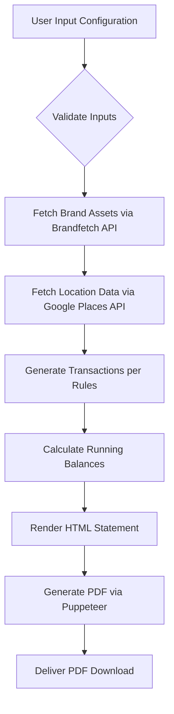

# Bank Statement Generation Comprehensive Guide (Combined)

## Overview

This guide consolidates all documentation for generating mock bank statements, including transaction rules, generation process, user specifications, and layout guidelines. It combines information from the original comprehensive guide and detailed transaction rules documentation.

## Transaction Rules

### General Principles

- **Date Range**: Transactions within user-defined start/end dates
- **Initial Balance**: Starts at $8,500.00
- **Variance Application**:
  - Once per statement: Consistent amounts for recurring items (coffee, rent, gym, etc.)
  - Per transaction: Variable amounts for groceries, petrol, occasional expenses
- **Localization**: Google Places API for real locations, fallback to probabilistic suburb selection
- **Formatting**: AUD currency, DD Mon YY dates

### Regulatory Compliance and Lending Assessment Criteria

The bank statement generation ensures full compliance with Australian lending regulations and laws, including but not limited to:

- **ASIC (Australian Securities and Investments Commission)**: Consumer credit regulations and disclosure requirements
- **APRA (Australian Prudential Regulation Authority)**: Prudential standards for authorized deposit-taking institutions
- **National Consumer Credit Protection Act 2009**: Responsible lending obligations and credit assessment requirements
- **Responsible Lending Obligations**: Assessment of customer's financial situation and requirements

**Key Compliance Features for High-Value Credit Approvals:**

#### Income Stability and Verification
- **Consistent Salary Deposits**: Regular, predictable income streams with minimal variance (<5% month-to-month)
- **Employer Verification Elements**: Include employer name, ABN, and address for lender verification
- **Income-to-Debt Ratios**: Maintain ratios that demonstrate ability to service additional credit (typically <30% of gross income)
- **Savings Patterns**: Automatic transfers to savings accounts demonstrating financial discipline

#### Credit Utilization and Payment History
- **Low Credit Utilization**: Maintain balances below 30% of available credit limits
- **Timely Payments**: All bills and obligations paid on or before due dates
- **No Overdrafts**: Avoid negative balances or overdraft usage
- **Credit Mix**: Include mix of transaction types showing responsible credit management

#### Transaction Patterns for Lender Assessment
- **Essential vs. Discretionary Spending**: Balanced ratio of 70% essentials (rent, utilities, groceries) to 30% discretionary
- **Cash Flow Management**: Demonstrate surplus income after essential expenses
- **Financial Planning**: Regular savings contributions and bill payments
- **Risk Indicators Avoidance**:
  - No frequent cash withdrawals or gambling transactions
  - No payday lending or high-interest borrowing
  - No returned payment fees or dishonor fees
  - No excessive ATM fees or international transaction fees

#### Maximum Credit Approval Optimization
- **Income Documentation**: Clear salary credits with employer details for income verification
- **Expense Stability**: Consistent recurring expenses demonstrating financial stability
- **Credit History Indicators**: Transaction patterns that align with prime lending criteria
- **Regulatory Compliance**: All transactions comply with anti-money laundering and counter-terrorism financing requirements

**Lending Assessment Metrics Alignment:**
- **Debt Servicing Ratio**: <30% of gross income allocated to debt repayments
- **Expense Coverage**: Essential expenses covered 2-3x by net income
- **Savings Rate**: Minimum 10-15% of income directed to savings
- **Credit Velocity**: Moderate transaction frequency without excessive spending

### Transaction Categories

```javascript
const merchantTypes = [
  'parking',
  'gas_station',
  'grocery_store',
  'restaurant',
  'atm',
  'pharmacy',
  'retail_store',
  'entertainment',
  'public_transport',
  'insurance',
  'online_shopping'
];

// Generate an array of all possible 3-digit codes from 100 to 999
function generateCodePool() {
  const codes = [];
  for (let i = 100; i <= 999; i++) {
    codes.push(i);
  }
  return codes;
}

// Fisher-Yates shuffle
function shuffle(array) {
  let currentIndex = array.length, randomIndex;

  while (currentIndex !== 0) {
    randomIndex = Math.floor(Math.random() * currentIndex);
    currentIndex--;

    // Swap
    [array[currentIndex], array[randomIndex]] = [array[randomIndex], array[currentIndex]];
  }
  return array;
}

// Assign random unique codes to merchant types
function assignRandomCodes(types) {
  const pool = generateCodePool();
  shuffle(pool);

  const typeCodes = {};
  types.forEach((type, index) => {
    typeCodes[type] = String(pool[index]);
  });

  return typeCodes;
}

function generateMerchantID(merchantType, typeCodes) {
  const prefix = '74';
  const group = typeCodes[merchantType];
  const store = String(Math.floor(Math.random() * 900) + 100);
  return `${prefix}${group}${store}`;
}

function getRandomItem(arr) {
  return arr[Math.floor(Math.random() * arr.length)];
}

// Your merchantType keyword mapping and merchant list omitted for brevity
// Reuse the inferMerchantType() function and merchantTypeKeywords map from previous example

const merchantTypeKeywords = {
  'coffee|cafe|bar': 'restaurant',
  'gym|fitness': 'entertainment',
  'clothing|department|book': 'retail_store',
  'ride|transport': 'public_transport',
  'market|grocer|organic': 'grocery_store',
  'tech|electronics|mobiles': 'online_shopping',
  'cinema|movie': 'entertainment',
  'pharmacy|chemist': 'pharmacy',
  'health|insurance': 'insurance',
  'atm|cash': 'atm',
  'station|fuel|gas': 'gas_station',
  'parking|garage': 'parking'
};

const newMerchants = [];

function inferMerchantType(name) {
  const lower = name.toLowerCase();
  for (const pattern in merchantTypeKeywords) {
    if (new RegExp(pattern).test(lower)) {
      return merchantTypeKeywords[pattern];
    }
  }
  return 'retail_store'; // fallback
}

// Assign highly randomized merchant type codes
const allTypes = Array.from(new Set(Object.values(merchantTypeKeywords)));
const merchantTypeCodes = assignRandomCodes(allTypes);

const merchantProfiles = {};

newMerchants.forEach(merchant => {
  const type = inferMerchantType(merchant);
  const id = generateMerchantID(type, merchantTypeCodes);
  merchantProfiles[merchant] = {
    merchantType: type,
    merchantID: id
  };
  console.log(`${merchant.padEnd(25)} | ${type.padEnd(18)} | Merchant ID: ${id}`);
});
```

## Transaction Breakdown

### 0. Description Variables
```javascript
let CARD4='V'+generateRandomDigits(4)
let TRANSACTION_REF=getRandomLetter()+74+generateRandomDigits(8)
```

### 1. Income

*   **Salary Credit**
    *   **Frequency**: User-defined (Weekly, Fortnightly, or Monthly).
    *   **Amount Calculation**:
        *   Net salary per period is calculated based on the provided `annualIncome` and selected `payrollFrequency`.
        *   A simplified tiered net percentage of gross annual income is used:
            *   Income ≤ $50,000: Net is 80% of Gross
            *   Income ≤ $100,000: Net is 70% of Gross
            *   Income ≤ $180,000: Net is 65% of Gross
            *   Income > $180,000: Net is 60% of Gross
    *   **Occurrence**:
        *   Weekly/Fortnightly: On Fridays.
        *   Monthly: On the 15th of the month (or the preceding Friday if the 15th is a weekend).
    *   **Description**: `SALARY CREDIT [EMPLOYER NAME IN CAPS]`

### 2. Savings

*   **Transfer to NAB Saver**
    *   **Frequency**: Occurs on the same day as the Salary Credit.
    *   **Amount**: Baseline 18% of the calculated `netSalaryForPeriod`, with a +/- 8% variance applied once per statement, then rounded to the nearest $10.
    *   **Description**: `TRANSFER TO NAB SAVER ACC 654321 [Ref]`

### 3. Regular Fixed-Frequency Debits

*   **Rent Payment**
    *   **Frequency**: Weekly, on Mondays.
    *   **Amount**: Base $680.00, with a variance of +/- 15% (applied once per statement; price is consistent within one statement).
    *   **Description**: `BPAY PAYMENT [DD/MM] [SUBURB] [ALPHA LETTER][9 DIGITS] DEFT RENT`

*   **Opal Top Up (Public Transport)**
    *   **Frequency**: Every 9-12 business days.
    *   **Amount**: Base $50.00.
    *   **Description**: `V OPAL TOPUP TRANSPORT NSW ONLINE`

*   **Microsoft Subscription**
    *   **Frequency**: Monthly, on the 25th of the month.
    *   **Amount**: $16.00 (fixed, no variance).
    *   **Description**: `DIRECT DEBIT MICROSOFT.COM/BILL`

*   **Netflix Subscription**
    *   **Frequency**: Monthly, on the 5th of the month.
    *   **Amount**: $25.99 (fixed, no variance).
    *   **Description**: `DIRECT DEBIT NETFLIX.COM/BILL`

*   **Spotify Subscription**
    *   **Frequency**: Monthly, on the 10th of the month.
    *   **Amount**: $13.99 (fixed, no variance).
    *   **Description**: `DIRECT DEBIT SPOTIFY AUS`

*   **Telco Bill (e.g., Mobile)**
    *   **Frequency**: Monthly, on the 15th of the month.
    *   **Amount**: Base $95.00, variance +/- 15% (applied once per statement).
    *   **Description**: `DIRECT DEBIT [TELSTRA, OPTUS, VODAFONE] MOBILENET`

*   **Insurance Premium**
    *   **Frequency**: Monthly, on the 20th of the month.
    *   **Amount**: Base $180.00, variance +/- 8% (applied once per statement).
    *   **Description**: `DIRECT DEBIT [MEDIBANK, NIB, AHM, BUPA, HCF]INSURANCE PREM`

### 4. Daily & Regular Variable Expenses

*   **Daily Coffee**
    *   **Frequency**: Every weekday (Monday - Friday).
    *   **Amount**: Base $5.80, variance +/- $0.30 (applied once per statement; price is consistent daily within one statement).
    *   **Description**: `V9173 DD/MM POS WDL [Fetched Cafe Name] [Fetched Cafe Suburb] [11-digit Ref]`. Name and suburb are fetched dynamically via Google Places API. Falls back to "GENERIC COFFEE SHOP" with probabilistic location if API fails.

*   **Gym Membership**
    *   **Frequency**: Monthly, on the 1st of the month.
    *   **Amount**: Base picked randomly of the following values: [21.99, 27.99, 32.99, 36.99, 39.99, 58.99] (applied once per statement).
    *   **Description**: `DIRECT DEBIT ANYTIME FITNESS [Closest Suburb]` (Location is the closest "Anytime Fitness" to account holder's address).

*   **Supermarket Groceries**
    *   **Frequency**: Bi-Weekly, once on Saturdays and the other day random between Monday - Thursday.
    *   **Amount**: Randomly chosen between $100.00 and $150.00 (applied per transaction).
    *   **Description**: `V9173 DD/MM POS WDL [COLES/WOOLWORTHS/ALDI/HARRIS FARM/IGA] [Closest Suburb] [11-digit Ref]`. Chain randomly chosen. Location is the closest branch of that chain to the account holder's address.

*   **Petrol**
    *   **Frequency**: Approximately once a week on a random weekday (Tuesday-Friday).
    *   **Amount**: Randomly chosen between $60.00 and $90.00 (applied per transaction).
    *   **Description**: `V9173 DD/MM POS WDL [BP CONNECT/SHELL/METRO PETROLEUM] [Closest Suburb] [11-digit Ref]`. Station randomly chosen. Location is the closest branch of that chain to the account holder's address.

### 5. Occasional & Probabilistic Expenses

*   **Meals Out / Food Delivery**
    *   **Frequency**: Occurs on Wednesdays and Fridays with a probability of ~70%, variance +/- 20% (this probability itself has a slight random fluctuation each check).
    *   **Amount**: Randomly chosen between $20.00 and $75.00 (applied per transaction).
    *   **Description**: `V9173 DD/MM POS WDL [THAI BLOOM/THE CORNER BISTRO/etc.] [API Suburb/Probabilistic Suburb] [11-digit Ref]` or `V9173 DD/MM POS WDL UBEREATS PAYMENT [11-digit Ref]`. Location for local restaurants uses Google Places API Text Search for "restaurant" in account holder's suburb, or probabilistic fallback.

*   **Shopping (Clothes/Tech)**
    *   **Frequency**: Occurs on the 15th of the month with a probability of ~30%, variance +/- 10% (this probability itself has a slight random fluctuation).
    *   **Amount**: Randomly chosen between $70.00 and $280.00 (applied per transaction).
    *   **Description**: `V9173 DD/MM POS WDL [UNIQLO/JB HI-FI/DAVID JONES/MYER/HARVEY NORMAN] [Closest Suburb/Probabilistic Hub] [11-digit Ref]`. Store randomly chosen. Location is the closest branch of that chain, or a major shopping hub.

*   **Entertainment (Cinema/Pub)**
    *   **Frequency**: Occurs on Saturdays that fall approximately in the 2nd and 4th week of the month (specifically, day of month > 7 and <= 14, OR day of month > 21 and <= 28). This occurs with a probability of ~60% (this probability itself has a slight random fluctuation).
    *   **Amount**: Randomly chosen between $35.00 and $125.00 (applied per transaction).
    *   **Description**: `V9173 DD/MM POS WDL [EVENT CINEMAS GEORGE ST/THE ROOFTOP BAR CBD/etc.] [Fixed or API Suburb/Probabilistic Suburb] [11-digit Ref]`. Venue randomly chosen. Location uses Google Places API Text Search for "bar" or "cinema" or is fixed, with probabilistic fallback.

*   **Fast Food**
    *   **Frequency**: Occurs with approximately 25% probability on any given day (i.e., about 1-2 times a week).
    *   **Amount**: Randomly chosen between $11.00 and $25.00 (applied per transaction).
    *   **Description**: `V9173 DD/MM POS WDL [MCDONALD'S/KFC/etc.] [Closest Suburb] [11-digit Ref]`. Restaurant randomly chosen. Location is the closest branch of that chain to the account holder's address.

### 6. Quarterly Utilities

*   **AGL (Electricity/Gas)**
    *   **Frequency**: Occurs on the 10th every 3 months.
    *   **Amount**: Base $425.00, variance +/- 13% (applied per transaction).
    *   **Description**: `DIRECT DEBIT AGL ENERGY REF 23984753`

*   **Sydney Water**
    *   **Frequency**: Occurs on the 5th every three months in the same month as the Electricity.
    *   **Amount**: Base $220.00, variance +/- 12% (applied per transaction).
    *   **Description**: `BPAY PAYMENT SYDNEY WATER CORP CRN 7890123`

## Related Documentation

### Cross-Reference Table
| Rule Category | Primary Reference | Related Documents |
|---------------|-------------------|-------------------|
| Income Calculation | [Transaction Rules - Income](#income) | [Payslip Calculations](Payslip_Streamlined_Documentation.md#earnings-calculation) |
| Date Alignment | [Transaction Rules - Income](#income) | [Bank Statement Alignment](Payslip_Streamlined_Documentation.md#bank-statement-alignment) |
| Variance Rules | [General Principles](#general-principles) | [Calculation Engine](Payslip_Streamlined_Documentation.md#calculation-engine) |
| Transaction Categories | [Transaction Categories](#transaction-categories) | [Merchant Localization](Google_Places_API_Complete_Integration.md#transaction-generation-integration) |
| Regulatory Compliance | [Regulatory Compliance](#regulatory-compliance-and-lending-assessment-criteria) | [Validation Rules](config-specification.md#validation) |

### Key Integration Points

#### Payslip Generator Integration
For detailed payslip generation that aligns with these transaction rules, see:
- [Payslip Generator Documentation](Payslip_Streamlined_Documentation.md)
- [Bank Statement Alignment](Payslip_Streamlined_Documentation.md#bank-statement-alignment)
- [Calculation Engine](Payslip_Streamlined_Documentation.md#calculation-engine)

#### API Integration
For location-based transaction generation, see:
- [Google Places API Integration](Google_Places_API_Complete_Integration.md)
- [Transaction Generation Integration](Google_Places_API_Complete_Integration.md#transaction-generation-integration)

#### PDF Generation
For document rendering and formatting, see:
- [Puppeteer PDF Generation Guide](Puppeteer_PDF_Generation_Guide.md)
- [A4 Document Generation](Puppeteer_PDF_Generation_Guide.md#a4-document-generation)

## Transaction Sorting & Balance

*   Transactions are first sorted chronologically by date.
*   For transactions occurring on the same date, they are sorted by an internal generation order ID to maintain consistency.
*   A running balance is calculated and updated after each transaction.

### Income Transactions

#### Salary Credit
- **Frequency**: User-defined (Weekly/Fortnightly/Monthly)
- **Amount**: Net salary based on annual income with tiered percentages:
  - ≤$50k: 80% net
  - ≤$100k: 70% net
  - ≤$180k: 65% net
  - >$180k: 60% net
- **Occurrence**: Fridays (weekly/fortnightly), 15th or preceding Friday (monthly)
- **Description**: `SALARY CREDIT [EMPLOYER] [Ref]`

#### Savings Transfer
- **Frequency**: Same day as salary
- **Amount**: 18% of net salary (variance +/-8%, rounded to nearest $10)
- **Description**: `TRANSFER TO NAB SAVER ACC 654321 [Ref]`

### Regular Debit Transactions

| Transaction | Frequency | Base Amount | Variance | Description |
|-------------|-----------|-------------|----------|-------------|
| Rent | Weekly (Mondays) | $700 | +/-$20 (once/statement) | `TRANSFER TO [AGENT] [Ref]` |
| Opal Top Up | Every 9-12 business days | $50 | None | `OPAL TOPUP TRANSPORT NSW ONLINE` |
| Gym | Monthly (1st) | Random: $21.99-$58.99 | Once/statement | `DIRECT DEBIT ANYTIME FITNESS [Suburb]` |
| Microsoft | Monthly (25th) | $16 | Fixed | `DIRECT DEBIT MICROSOFT.COM/BILL` |
| Netflix | Monthly (5th) | $25.99 | Fixed | `DIRECT DEBIT NETFLIX.COM/BILL` |
| Spotify | Monthly (10th) | $13.99 | Fixed | `DIRECT DEBIT SPOTIFY AUS` |
| Telco | Monthly (15th) | $95 | +/-15% (once/statement) | `DIRECT DEBIT [PROVIDER] MOBILENET` |
| Insurance | Monthly (20th) | $180 | +/-8% (once/statement) | `DIRECT DEBIT [PROVIDER]INSURANCE PREM` |

### Variable Transactions

#### Daily Coffee
- **Frequency**: Weekdays (Mon-Fri)
- **Amount**: $5.80 +/-$0.30 (consistent per statement)
- **Description**: `V9173 DD/MM POS WDL [Cafe Name] [Suburb] [Ref]`

#### Weekly Groceries
- **Frequency**: Bi-weekly (Saturdays + random Mon-Thu)
- **Amount**: $100-$150 (per transaction)
- **Description**: `V9173 DD/MM POS WDL [Chain] [Suburb] [Ref]`

#### Petrol
- **Frequency**: ~Weekly (Tue-Fri)
- **Amount**: $60-$90 (per transaction)
- **Description**: `V9173 DD/MM POS WDL [Station] [Suburb] [Ref]`

### Occasional Transactions

#### Meals/Food Delivery
- **Frequency**: Wed/Fri with ~70% probability
- **Amount**: $20-$75
- **Description**: `V9173 DD/MM POS WDL [Restaurant] [Suburb] [Ref]` or `UBEREATS PAYMENT [Ref]`

#### Shopping
- **Frequency**: 15th of month (~30% probability)
- **Amount**: $70-$280
- **Description**: `V9173 DD/MM POS WDL [Store] [Suburb] [Ref]`

#### Entertainment
- **Frequency**: Saturdays in weeks 2/4 of month (~60% probability)
- **Amount**: $35-$125
- **Description**: `V9173 DD/MM POS WDL [Venue] [Suburb] [Ref]`

#### Fast Food
- **Frequency**: ~25% daily probability
- **Amount**: $11-$25
- **Description**: `V9173 DD/MM POS WDL [Chain] [Suburb] [Ref]`

### Quarterly Utilities

#### Electricity/Gas (AGL)
- **Frequency**: 10th every 3 months
- **Amount**: $425 +/-13%
- **Description**: `DIRECT DEBIT AGL ENERGY REF 23984753`

#### Water (Sydney Water)
- **Frequency**: 5th every 3 months (same month as electricity)
- **Amount**: $220 +/-12%
- **Description**: `BPAY PAYMENT SYDNEY WATER CORP CRN 7890123`

### Transaction Processing

- **Sorting**: Chronological by date, then by internal ID
- **Balance Calculation**: Running balance updated per transaction
- **References**: Alphanumeric for transfers, 11-digit numeric for card transactions

## Generation Process



### Key Process Steps

1. **User Configuration**: General details, employer info, transaction settings
2. **Validation**: Ensure all required inputs provided
3. **API Integration**:
   - Brandfetch: Bank logos and branding
   - Google Places: Real merchant locations and names
4. **Transaction Generation**: Apply rules with variance and localization
5. **Balance Calculation**: Maintain accurate running totals
6. **Rendering**: HTML layout with proper styling
7. **PDF Generation**: Convert to downloadable format

### Recommendations

- **Caching**: Implement for API calls to reduce latency
- **Async Processing**: Queue PDF generation for better UX
- **Input Validation**: Real-time client-side validation
- **User Profiles**: Save configurations for reuse

## User Input Specification

### General Configuration

| Field | Type | Required | Example |
|-------|------|----------|---------|
| Bank Name | String | Yes | "Up Bank" |
| Account Holder Name | String | Yes | "John Doe" |
| Account Holder Address | String | Yes | "123 Main St, Sydney NSW 2000" |
| Statement Period Start | Date | Yes | "01 Jan 2025" |
| Statement Period End | Date | Yes | "31 Mar 2025" |
| Opening Balance | Number | Yes | 8500.00 |
| Statement Date | Date | Yes | "04 Apr 2025" |

### Employer Details

| Field | Type | Required | Example |
|-------|------|----------|---------|
| Employer Name | String | Yes | "ACME Inc." |
| ABN | String | Yes | "12345678901" |
| Address | String | Yes | "456 Corp Ave, Sydney NSW 2000" |
| Annual Income | Number | Yes | 85000 |
| Employer Logo | File | No | logo.svg |

### Transaction Configuration

- **Include/Exclude Types**: Arrays of transaction categories
- **Overrides**: Custom frequency/amount/variance settings
- **Activatable Transactions**: Toggle switches for each transaction type

### Bank-Specific Details

#### Up Bank
- Account Name: "Spending", "Savings"
- Account Number: "633-000 123456789"
- Statement Style: "Default"

#### ANZ
- Account Type: "Access Advantage", "Rewards Visa"
- Account Number: "012-345 123456789"

#### CBA
- Account Type: "Smart Access", "Low Rate MC"
- Account Number: "062-000 12345678"

#### NAB
- Account Type: "Classic Banking", "iSaver"
- Account Number: "082-057 123456789"

## Layout and Styling Guidelines

### Document Structure

- **Format**: Single-column PDF, A4 portrait
- **Margins**: 1 inch (72px) all sides
- **Sections**: Header, Summary, Transactions, Footer

### Typography (Up Bank Style)

| Element | Font | Size | Weight | Alignment |
|---------|------|------|--------|-----------|
| Title | Arial | 24pt | Bold | Left |
| Bank Details | Arial | 8pt | Regular | Left |
| Customer Details | Arial | 10pt | Regular | Left |
| Summary Labels | Arial | 10pt | Regular | Left |
| Transaction Date | Arial | 12pt | Bold | Left |
| Transaction Details | Arial | 10pt | Regular | Left |
| Footer | Arial | 8pt | Regular | Left |

### NAB-Specific Layout

- **Page Size**: 595×842px (A4 at 72 DPI)
- **Content Area**: 451×698px
- **Table Structure**: 5 columns (Date, Particulars, Debits, Credits, Balance)
- **Column Widths**: 12%, 48%, 13%, 13%, 14%
- **Row Heights**: Header 24px, Data 18px

### Color Scheme

- **Primary**: Black text (#000000) on white background (#FFFFFF)
- **Borders**: Black (#000000)
- **No highlights or background colors**

### Key Layout Elements

#### Header
- Statement title centered
- Bank branding and customer details
- Account information (BSB/Account Number)

#### Summary Section
- Opening/Closing balances
- Money In/Out/Saved totals
- Aligned value presentation

#### Transaction Table
- Date headers for each day
- Multi-line transaction entries
- Running balance column
- Right-aligned amounts

#### Footer
- Legal disclaimers
- Generation timestamp
- Page numbering

## Technical Implementation Notes

### API Integrations

#### Google Places API
- **Geocoding**: Convert addresses to coordinates
- **Nearby Search**: Find closest merchant locations
- **Text Search**: Generic business type searches
- **Fallback**: Probabilistic suburb selection

#### Brandfetch API
- **Logo Retrieval**: Bank-specific branding assets
- **Caching**: Store results to reduce API calls

### Transaction Generation Logic

#### Variance Application
```javascript
// Once per statement
const baseAmount = 700;
const variance = baseAmount * (Math.random() * 0.06 - 0.03); // +/-3%
const finalAmount = Math.round((baseAmount + variance) * 100) / 100;

// Per transaction
const transactionAmount = 125 + (Math.random() * 25); // $100-150
```

#### Localization Logic
```javascript
// API-first approach with fallbacks
async function getMerchantLocation(merchantType, userAddress) {
  try {
    // Try Google Places API
    const result = await placesAPI.nearbySearch({
      location: userAddress,
      type: merchantType
    });
    return result.name + ', ' + result.suburb;
  } catch (error) {
    // Fallback to probabilistic selection
    return getFallbackLocation(merchantType, userSuburb);
  }
}
```

### PDF Generation

#### Puppeteer Configuration
```javascript
const browser = await puppeteer.launch();
const page = await browser.newPage();
await page.setContent(htmlContent);
await page.pdf({
  format: 'A4',
  margin: {
    top: '1in',
    right: '1in',
    bottom: '1in',
    left: '1in'
  }
});
```

### Security Considerations

- **Input Validation**: Sanitize all user inputs
- **API Keys**: Secure storage of Google Places and Brandfetch keys
- **PDF Security**: Optional password protection
- **Data Privacy**: No sensitive data storage

### Performance Optimization

- **API Caching**: Redis or in-memory cache for location data
- **Async Processing**: Queue PDF generation
- **Lazy Loading**: Load transaction data on demand
- **Compression**: Optimize PDF file size

## Version History

- **v1.0**: Consolidated documentation from multiple sources (Sep 2025)
- **v1.1**: Combined Bank_Statement_Comprehensive_Guide.md and transactionRules.md for complete transaction rules and implementation details (Sep 2025)
- **Consolidated from**: BankStatement.md, transactionRules.md, BPMN process, generation spec, layout guide, NAB specification
