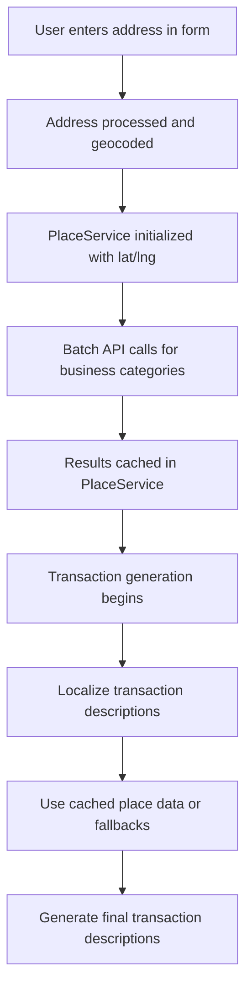

# Google Places API Complete Integration Guide

## Overview

This comprehensive guide consolidates the integration of Google Places API, Address Autocomplete API, Geocoding API, and associated caching strategies for the NAB Bank Statement Generator. The integration enhances the authenticity of generated bank statements by incorporating real-world business names and locations based on account holder addresses, while providing robust error handling and performance optimization.

> **Note:** This repository captures the integration blueprint. The referenced services (`placeService`, `geocodingService`, proxy routes, etc.) live in the downstream generator codebase and are not present within this documentation repository. Treat the file paths below as canonical module names rather than files on disk here.

## Architecture Overview

### System Components

1. **Frontend Application** (downstream modules such as `utils/geocodingService.ts`, `utils/placeService.ts`)
2. **Proxy Server** (downstream services such as `proxy-server/server.js`, `proxy-server/routes/places.js`, `proxy-server/routes/geocode.js`)
3. **Google APIs** (Geocoding API, Places API v1, Address Autocomplete API)
4. **Transaction Generation Engine** (`utils/transaction-generator.ts`, `utils/transactionUtils.ts`)

### Data Flow



## Google APIs Integration

### 1. Address Autocomplete API

#### Frontend Implementation
Uses Google Maps JavaScript API Places library for real-time suggestions, reducing input errors and improving accuracy.

**Key Benefits:**
- Real-time dropdown suggestions
- Minimized typos and formatting issues
- Standardized address data

**Code Example:**
```javascript
async function initMap(): Promise<void> {
    await google.maps.importLibrary("places") as google.maps.PlacesLibrary;
    const placeAutocomplete = new google.maps.places.PlaceAutocompleteElement();
    document.body.appendChild(placeAutocomplete);

    const selectedPlaceTitle = document.createElement('p');
    selectedPlaceTitle.textContent = '';
    document.body.appendChild(selectedPlaceTitle);

    const selectedPlaceInfo = document.createElement('pre');
    selectedPlaceInfo.textContent = '';
    document.body.appendChild(selectedPlaceInfo);

    placeAutocomplete.addEventListener('gmp-select', async ({ placePrediction }) => {
        const place = placePrediction.toPlace();
        await place.fetchFields({ fields: ['displayName', 'formattedAddress', 'location'] });
        selectedPlaceTitle.textContent = 'Selected Place:';
        selectedPlaceInfo.textContent = JSON.stringify(
            place.toJSON(), null, 2);
    });
}

initMap();
```

#### Backend Process
Handles data capture, validation, and storage of addresses with coordinates.

**Data Flow:**
1. Frontend sends selected address data (including location object with lat/lng)
2. Backend validates data for required components and valid coordinates
3. Stores validated address and coordinates in database

#### Database Schema Updates
Added latitude/longitude columns to support proximity features.

**account_holder Table:**
- `address_latitude`: DECIMAL(10, 8)
- `address_longitude`: DECIMAL(11, 8)

**employer Table:**
- `address_latitude`: DECIMAL(10, 8)
- `address_longitude`: DECIMAL(11, 8)

### 2. Geocoding Service

**Purpose:** Convert user-provided addresses into latitude/longitude coordinates for location-based queries.

**Implementation:**
- **File:** `utils/geocodingService.ts`
- **Proxy Endpoint:** `POST /api/geocode`
- **Google API:** Google Geocoding API
- **Caching:** 24 hours server-side

**Process:**
1. User address is sent to proxy server
2. Proxy constructs Google Geocoding API URL with address and API key
3. Response includes lat/lng coordinates
4. Coordinates used to initialize PlaceService

**Error Handling:**
- Returns fallback coordinates (Sydney: -33.8688, 151.2093) if geocoding fails
- Logs errors but doesn't break statement generation

### 3. Places Service

**Purpose:** Fetch real business names and locations near the account holder's address for transaction descriptions.

**Implementation:**
- **File:** `utils/placeService.ts`
- **Proxy Endpoint:** `POST /api/places-nearby`
- **Google API:** Google Places API v1 (Nearby Search)
- **Caching:** 1 hour server-side, session-based client-side

**Supported Business Categories:**
- Coffee shops and cafes
- Supermarkets and grocery stores
- Gas stations
- Gyms
- Restaurants and food delivery
- Department stores and shopping
- Movie theaters and bars

## Place Types Reference

Google Places API supports various place types categorized as follows:

### Transaction Types
- CardParticular
- OnlineParticular
- EFTPOSParticular
- ATMParticular

### Places Categories

#### Automotive
- car_repair
- car_wash
- gas_station
- parking

#### Entertainment
- amusement_park
- aquarium
- bowling_alley
- casino
- internet_cafe
- karaoke
- movie_theater
- night_club
- opera_house
- roller_coaster
- zoo

#### Finance
- bank
- atm

#### Food & Drink
- bar
- wine_bar
- cafe
- coffee_shop
- restaurant
- fast_food_restaurant
- food_delivery

#### Health & Fitness
- pharmacy
- yoga_studio
- gym
- doctor
- dentist
- swimming_pool

#### Services
- hair_salon
- telecommunications_service_provider
- laundry
- post_office
- insurance_agency
- florist

#### Shopping
- asian_grocery_store
- butcher_shop
- convenience_store
- supermarket
- department_store
- electronics_store
- hardware_store
- liquor_store
- shoe_store
- clothing_store
- book_store

#### Transportation
- train_station
- bus_station
- light_rail_station
- taxi_stand

### Expense Categories (for reference)

#### Fixed Expenses
- **Utilities:** electricity (quarterly), gas (quarterly), water (quarterly), internet (monthly), mobile (monthly)
- **Insurance:** health_insurance, DEFT Rent Payment, Payroll, Savings

#### Variable Expenses
- supermarket
- morning coffee
- petrol
- food_delivery
- fast_food
- restaurant

## Proxy Server Implementation

**Purpose:** Securely handle Google API calls and manage API keys.

**Key Features:**
- **CORS Handling:** Allows requests from frontend (localhost:5173)
- **API Key Security:** Keys stored in environment variables
- **Caching:** In-memory caching with TTL
- **Error Handling:** Comprehensive error responses
- **Logging:** Detailed request/response logging

**Endpoints:**

#### `/api/geocode` (GET)
- **Purpose:** Geocode addresses to coordinates
- **Parameters:** `address` (query string)
- **Response:** Google Geocoding API JSON response
- **Caching:** 24 hours

#### `/api/places-nearby` (POST)
- **Purpose:** Find nearby places by category
- **Parameters:**
  - `includedTypes`: Array of place types
  - `locationRestriction.circle.center`: Lat/lng coordinates
  - `locationRestriction.circle.radius`: Search radius (50km default)
  - `rankPreference`: "DISTANCE"
  - `maxResultCount`: Maximum results (10-20)
- **Response:** Google Places API JSON response
- **Caching:** 1 hour

## Transaction Generation Integration

### Localization Process

During transaction generation, the system localizes descriptions using the following hierarchy:

1. **API-Driven Localization** (Primary)
   - Query PlaceService for real business names near user location
   - Use exact matches when possible (e.g., "Anytime Fitness" for gym transactions)
   - Random selection from available places for variety

2. **Fallback Localization** (Secondary)
   - Parse suburb from user address using `parseSuburbFromAddressString()`
   - Use predefined nearby suburbs for the parsed suburb
   - Major shopping hubs (CBD, PITT ST MALL) for shopping transactions

3. **Static Fallbacks** (Tertiary)
   - Hardcoded business names when API and parsing fail
   - Generic descriptions like "GENERIC COFFEE SHOP"

### Transaction Categories with API Integration

| Category | Template | API Usage | Fallback |
|----------|----------|-----------|----------|
| Coffee | `POS WDL {BRAND} {LOCATION}` | Nearby cafes | "GLORIA JEANS COFFEE" |
| Groceries | `POS WDL {BRAND} {LOCATION}` | Nearby supermarkets | Random from ["COLES", "WOOLWORTHS", "ALDI"] |
| Petrol | `POS WDL {BRAND} {LOCATION}` | Nearby gas stations | Random from ["BP CONNECT", "SHELL"] |
| Gym | `DIRECT DEBIT {BRAND} {LOCATION}` | Nearby gyms | "ANYTIME FITNESS" |
| Fast Food | `POS WDL {BRAND} {LOCATION}` | Nearby restaurants | Random from ["MCDONALD'S", "KFC"] |
| Food Delivery | `POS WDL {BRAND} {LOCATION}` | Nearby restaurants | "UBEREATS" (40% chance) |
| Shopping | `POS WDL {BRAND} {LOCATION}` | Nearby stores | Random from shopping brands |
| Entertainment | `POS WDL {BRAND} {LOCATION}` | Nearby cinemas/bars | Random from venue lists |

### Address Processing

**File:** `utils/addressProcessingUtils.ts`

**Process:**
1. Extract suburb using `parseSuburbFromAddressString()`
2. Parse state and postcode from address
3. Create `suburbForConfig` for fallback localization
4. Handle edge cases (missing data, parsing failures)

**Heuristics Used:**
- Comma-separated address parts
- Postcode proximity detection
- State abbreviation recognition
- Word pattern analysis

## Caching Strategy

### Multi-Level Caching

1. **Server-Side Caching** (Proxy)
   - Geocoding: 24 hours
   - Places: 1 hour
   - In-memory Map storage
   - Automatic cleanup on TTL expiry

2. **Client-Side Caching** (PlaceService)
   - Session-based caching during statement generation
   - Per-request cache keys
   - Cleared after each statement generation

3. **Request Deduplication**
   - Cache keys based on request parameters
   - Prevents duplicate API calls for same queries

4. **Distributed Caching**
   - **Technology:** Redis for dynamic data
   - **Data Types:** API responses, user sessions, configuration
   - **CDN:** Cloudflare or CloudFront for static assets

### Cache Key Generation

**Geocoding:** `address` string
**Places:** `includedTypes.join(',')-${latitude},${longitude}-${resultLimit}`

### Cache Invalidation Strategy

#### Template Updates
- **Method:** TTL (5-10 minutes) + explicit invalidation on database updates

#### User Quota Updates
- **Method:** Event-driven invalidation (publish events on quota changes)

#### General Content Updates
- **Method:** Cache-busting for static assets, explicit invalidation for dynamic content

## Error Handling and Resilience

### API Failure Scenarios

1. **Network Failures**
   - Automatic fallback to parsed suburb
   - Logging of errors without breaking generation

2. **API Quota Exceeded**
   - Graceful degradation to static fallbacks
   - User notification of service limitations

3. **Invalid Responses**
   - Validation of API response structure
   - Fallback to alternative data sources

4. **Geocoding Failures**
   - Default to Sydney coordinates
   - Continue with location-based generation

### Logging and Monitoring

**Log Levels:**
- **DEBUG:** API request/response details
- **INFO:** Successful operations
- **WARN:** Fallback activations
- **ERROR:** API failures and exceptions

**Logged Events:**
- API call initiation and completion
- Cache hits/misses
- Error conditions and fallbacks
- Performance metrics

**Monitoring Metrics:**
- Cache hit/miss ratio (>90% target)
- Latency comparison (cached vs non-cached)
- Database load and connection counts
- Page load times
- Tools: Prometheus, Grafana, provider dashboards

## Configuration and Constants

### API Configuration
```typescript
// constants/appConstants.ts
export const API_CONFIG = {
  PROXY_BASE_URL: 'http://localhost:3001/api',
  GEOCODING_ENDPOINT: '/geocode',
  PLACES_ENDPOINT: '/places-nearby',
}
```

### Place Service Configuration
```typescript
export const PLACE_SERVICE_CONFIG = {
  SEARCH_RADIUS: 50000, // meters
  MAX_RESULTS: 10,
  RANK_PREFERENCE: 'DISTANCE',
}
```

### Cache Configuration
```typescript
export const CACHE_CONFIG = {
  DEFAULT_TTL: 3600000, // 1 hour
  MAX_CACHE_SIZE: 100,
}
```

## Performance Considerations

### Optimization Strategies

1. **Batch API Calls:** PlaceService fetches all categories at initialization
2. **Intelligent Caching:** Different TTLs for different data types
3. **Request Deduplication:** Prevents redundant API calls
4. **Lazy Loading:** Places fetched only when needed during generation

### Rate Limiting Awareness

- Google Places API has usage limits
- Caching reduces API calls significantly
- Fallbacks ensure functionality even with API limitations

## Security Considerations

### API Key Management

1. **Environment Variables:** Keys stored securely in `.env` files
2. **Server-Side Only:** Keys never exposed to frontend
3. **Proxy Pattern:** All API calls routed through backend
4. **CORS Restrictions:** Only allow frontend origin

### Data Privacy

- User addresses processed server-side only
- No personal data stored in caches
- API responses cached temporarily for performance
- All data cleared after session completion

## Future Enhancements

### Potential Improvements

1. **Enhanced Caching:** Redis-based persistent caching
2. **Location Intelligence:** More sophisticated location matching
3. **Business Type Expansion:** Additional categories and services
4. **Real-time Updates:** Dynamic business data integration
5. **Performance Monitoring:** Detailed API usage analytics

### Scalability Considerations

1. **Load Balancing:** Multiple proxy server instances
2. **Database Caching:** Persistent storage for frequently used data
3. **API Quota Management:** Intelligent request throttling
4. **Fallback Networks:** Multiple geocoding/place services

## Conclusion

The Google Places API integration significantly enhances the realism of generated bank statements by providing authentic business names and locations. The robust architecture with comprehensive error handling, intelligent caching, and fallback mechanisms ensures reliable operation even under adverse conditions. The modular design allows for easy maintenance and future enhancements while maintaining security and performance standards.

## Implementation Phases

1. **Infrastructure Setup** (2 weeks): Redis cluster, CDN configuration
2. **Application Integration** (4 weeks): Redis client, caching logic, HTTP headers, CDN integration
3. **Invalidation & Monitoring** (3 weeks): Invalidation logic, performance dashboards
4. **Rollout & Optimization** (Ongoing): Gradual production rollout, real-world optimization
