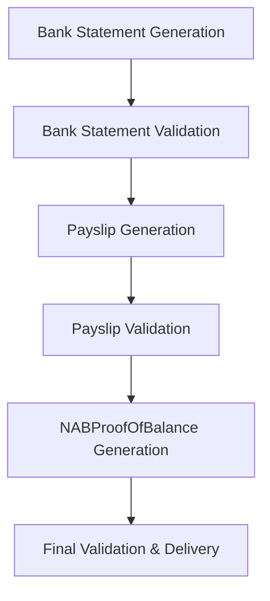

# NAB Proof of Balance Generation Guide

## Overview

This comprehensive guide documents the process for generating the NABProofOfBalance.pdf document, which serves as a formal letter from National Australia Bank (NAB) confirming the closing balance from a previously generated bank statement. This document ensures regulatory compliance and provides customers with an official record of their account balance.

### Purpose and Business Value

The NABProofOfBalance.pdf serves multiple critical business purposes:

- **Regulatory Compliance**: Provides formal documentation for lending assessments and financial verification
- **Customer Confidence**: Offers customers an official bank-issued confirmation of their account balance
- **Audit Trail**: Creates a timestamped record for financial transactions and balances
- **Legal Protection**: Establishes an official record that can be used in legal proceedings if required

### Key Requirements

- **Balance Alignment**: Must directly reference and align with the closing balance from the generated bank statement
- **Sequential Generation**: Must be generated strictly after bank statement creation and validation, followed by payslip generation
- **Formal Structure**: Must follow NAB's official letter format and branding guidelines
- **Data Accuracy**: All financial figures must be mathematically accurate and traceable to source documents

## Dependencies and Sequencing Rules

### Process Dependencies

The NABProofOfBalance.pdf generation depends on the successful completion of the following processes:

#### 1. Bank Statement Generation (Primary Dependency)
- **Source**: Bank Statement Generator system
- **Required Data**:
  - Account holder name and details
  - Account number and BSB
  - Statement period (start/end dates)
  - Closing balance amount
  - Statement date
  - Bank branding and formatting
- **Validation Requirements**:
  - Statement must be fully generated and validated
  - All transactions must be processed and balanced
  - PDF must be successfully created

#### 2. Payslip Generation (Secondary Dependency)
- **Source**: Payslip Generator system
- **Required Data**:
  - Employee income details
  - Pay period information
  - Net salary amounts
- **Validation Requirements**:
  - Payslips must align with bank statement income entries
  - All payslip calculations must be verified
  - PDF generation must be successful

#### 3. Technical Dependencies
- **Puppeteer Library**: For PDF generation
- **NAB Branding Assets**: Logos, fonts, and styling
- **Template System**: HTML/CSS templates for letter formatting
- **Data Validation**: Input sanitization and business rule validation

### Sequencing Rules

#### Strict Generation Order



#### Timing Constraints

1. **Minimum Delay**: 30 seconds after bank statement validation to ensure data consistency
2. **Maximum Delay**: 24 hours to maintain data freshness and relevance
3. **Concurrent Processing**: Can run concurrently with other non-dependent processes

#### Failure Handling

- **Bank Statement Failure**: Halt NABProofOfBalance generation and notify user
- **Payslip Failure**: Halt generation and provide detailed error information
- **Data Mismatch**: If balance discrepancies detected, halt and flag for manual review

## Step-by-Step Generation Process

### Phase 1: Data Collection and Validation

#### Step 1.1: Gather Source Data
```javascript
// Collect required data from completed processes
const sourceData = {
  bankStatement: {
    accountHolder: "JOHN A CITIZEN",
    accountNumber: "082-057 123456789",
    closingBalance: 8500.00,
    statementDate: "2025-01-31",
    statementPeriod: {
      start: "2025-01-01",
      end: "2025-01-31"
    }
  },
  payslips: {
    generated: true,
    count: 5,
    totalIncome: 8500.00,
    lastPayDate: "2025-01-30"
  },
  bankDetails: {
    name: "National Australia Bank",
    address: "Level 10, 700 Bourke St, Docklands VIC 3008",
    abn: "12 004 044 937",
    logo: "nab-logo.png"
  }
};
```

#### Step 1.2: Validate Data Integrity
```javascript
// Validate all required data is present and consistent
function validateSourceData(data) {
  const validations = [
    data.bankStatement.closingBalance > 0,
    data.bankStatement.accountHolder,
    data.bankStatement.accountNumber,
    data.payslips.generated === true,
    data.payslips.totalIncome === data.bankStatement.closingBalance,
    new Date(data.bankStatement.statementDate) > new Date(data.payslips.lastPayDate)
  ];

  return validations.every(v => v === true);
}
```

#### Step 1.3: Prepare Template Data
```javascript
// Format data for template rendering
const templateData = {
  letterDate: new Date().toLocaleDateString('en-AU'),
  referenceNumber: generateReferenceNumber(),
  customerDetails: {
    name: sourceData.bankStatement.accountHolder,
    address: "456 Oak Avenue, Newtown NSW 2042" // From shared data
  },
  balanceDetails: {
    amount: sourceData.bankStatement.closingBalance,
    date: sourceData.bankStatement.statementDate,
    account: sourceData.bankStatement.accountNumber
  },
  bankDetails: sourceData.bankDetails
};
```

### Phase 2: Template Rendering

#### Step 2.1: Load HTML Template
```html
<!DOCTYPE html>
<html lang="en-AU">
<head>
    <meta charset="UTF-8">
    <title>NAB Proof of Balance</title>
    <link href="https://fonts.googleapis.com/css2?family=Arial:wght@400;700&display=swap" rel="stylesheet">
    <style>
        /* NAB-specific styling */
        body { font-family: Arial, sans-serif; margin: 0; padding: 0; }
        .letterhead { background: #E31837; color: white; padding: 20px; }
        .content { margin: 40px; line-height: 1.6; }
        .balance-highlight { background: #f0f0f0; padding: 20px; border-left: 4px solid #E31837; }
        .signature { margin-top: 60px; }
    </style>
</head>
<body>
    <!-- Template content will be inserted here -->
</body>
</html>
```

#### Step 2.2: Render Dynamic Content
```javascript
// Render the letter content
const letterContent = `
  <div class="letterhead">
    
    <div style="margin-top: 10px;">
      <strong>${templateData.bankDetails.name}</strong><br>
      ${templateData.bankDetails.address}<br>
      ABN: ${templateData.bankDetails.abn}
    </div>
  </div>

  <div class="content">
    <div style="text-align: right; margin-bottom: 40px;">
      ${templateData.letterDate}<br>
      Reference: ${templateData.referenceNumber}
    </div>

    <div class="customer-details" style="margin-bottom: 30px;">
      ${templateData.customerDetails.name}<br>
      ${templateData.customerDetails.address}
    </div>

    <h2 style="color: #E31837; margin-bottom: 20px;">Proof of Account Balance</h2>

    <p>Dear ${templateData.customerDetails.name.split(' ')[0]},</p>

    <p>This letter serves as official confirmation from National Australia Bank regarding the balance of your account.</p>

    <div class="balance-highlight">
      <strong>Account Balance Confirmation:</strong><br><br>
      Account Number: ${templateData.balanceDetails.account}<br>
      Balance as at: ${templateData.balanceDetails.date}<br>
      Closing Balance: <strong>$${templateData.balanceDetails.amount.toLocaleString('en-AU', {minimumFractionDigits: 2})}</strong>
    </div>

    <p>This balance has been verified against your recent bank statement and corresponds to the closing balance shown on the statement dated ${templateData.balanceDetails.date}.</p>

    <p>This confirmation is provided for your records and may be used for official purposes including lending applications, visa applications, or other verification requirements.</p>

    <p>If you have any questions regarding this confirmation, please contact your local NAB branch or call 13 22 65.</p>

    <p>Yours sincerely,</p>

    <div class="signature">
      <strong>National Australia Bank</strong><br>
      Authorised Signatory<br><br>
      
    </div>
  </div>

  <div style="margin: 40px; padding-top: 20px; border-top: 1px solid #ccc; font-size: 10px; color: #666;">
    <p>This is an official document from National Australia Bank. For security purposes, please retain this document in a safe place.</p>
    <p>Generated on: ${new Date().toISOString()} | Reference: ${templateData.referenceNumber}</p>
  </div>
`;
```

### Phase 3: PDF Generation

#### Step 3.1: Configure Puppeteer
```javascript
const puppeteer = require('puppeteer');

async function generateNABProofOfBalance(templateData) {
  const browser = await puppeteer.launch({
    headless: true,
    args: [
      '--no-sandbox',
      '--disable-setuid-sandbox',
      '--disable-dev-shm-usage',
      '--disable-accelerated-2d-canvas',
      '--no-first-run',
      '--no-zygote',
      '--disable-gpu'
    ]
  });

  const page = await browser.newPage();

  // Set A4 viewport
  await page.setViewport({
    width: 794, // A4 width at 96 DPI
    height: 1123, // A4 height at 96 DPI
    deviceScaleFactor: 1
  });
}
```

#### Step 3.2: Render and Generate PDF
```javascript
// Set the HTML content
await page.setContent(letterContent, {
  waitUntil: 'networkidle0'
});

// Wait for fonts and images to load
await page.waitForTimeout(1000);

// Generate PDF with NAB-specific settings
await page.pdf({
  path: 'NABProofOfBalance.pdf',
  format: 'A4',
  printBackground: true,
  margin: {
    top: '25mm',
    right: '20mm',
    bottom: '25mm',
    left: '20mm'
  },
  displayHeaderFooter: false,
  preferCSSPageSize: true
});

await browser.close();
```

#### Step 3.3: Post-Generation Validation
```javascript
// Validate the generated PDF
const fs = require('fs');

function validateGeneratedPDF(filePath) {
  const stats = fs.statSync(filePath);

  const validations = [
    stats.size > 50000, // Minimum reasonable size
    fs.existsSync(filePath),
    // Additional PDF validation could be added here
  ];

  return validations.every(v => v === true);
}
```

## Key Components and Structure

### Document Structure

The NABProofOfBalance.pdf follows a formal business letter structure:

#### 1. Letterhead (Header)
- **NAB Logo**: Official bank branding
- **Bank Details**: Complete address and ABN
- **Color Scheme**: Red and white NAB branding colors
- **Typography**: Arial font family for professional appearance

#### 2. Letter Metadata
- **Date**: Current date of generation
- **Reference Number**: Unique identifier for tracking
- **Customer Address**: Formatted recipient address

#### 3. Main Content
- **Salutation**: Personalized greeting
- **Purpose Statement**: Clear explanation of document purpose
- **Balance Confirmation**: Highlighted section with key financial information
- **Context**: Reference to source bank statement
- **Usage Guidance**: Instructions for document use

#### 4. Closing and Signature
- **Sign-off**: Professional closing phrase
- **Signature Block**: Authorized signatory information
- **Signature Image**: Digital representation of signature

#### 5. Footer and Disclaimers
- **Security Notice**: Instructions for document storage
- **Generation Metadata**: Timestamp and reference information
- **Contact Information**: Bank contact details

### Data Elements

#### Required Data Fields
| Field | Source | Format | Validation |
|-------|--------|--------|------------|
| Account Holder Name | Bank Statement | String | Required, non-empty |
| Account Number | Bank Statement | XXX-XXX XXXXXXXX | Valid NAB format |
| Closing Balance | Bank Statement | Currency | > 0, matches statement |
| Statement Date | Bank Statement | DD/MM/YYYY | Valid date, past |
| Customer Address | Shared Data | Multi-line string | Required |
| Bank Details | Configuration | Structured object | Complete |

#### Calculated Fields
- **Reference Number**: Auto-generated unique identifier
- **Letter Date**: Current date at generation time
- **Formatted Balance**: Currency-formatted with AUD symbol

## Edge Cases and Variations

### Balance Discrepancies

#### Scenario: Balance Mismatch
```javascript
// Detection logic
function detectBalanceDiscrepancy(bankStatementBalance, payslipTotal) {
  const tolerance = 0.01; // 1 cent tolerance
  return Math.abs(bankStatementBalance - payslipTotal) > tolerance;
}

// Handling
if (detectBalanceDiscrepancy(balance, payslipTotal)) {
  throw new Error('Balance discrepancy detected. Manual review required.');
}
```

#### Resolution Options
1. **Automatic Recalculation**: Re-run bank statement generation
2. **Manual Override**: Allow authorized user to approve discrepancy
3. **Error Logging**: Record discrepancy for audit purposes

### Multiple Accounts

#### Scenario: Customer with Multiple Accounts
```javascript
// Handle multiple account balances
const accountBalances = [
  { account: '082-057 123456789', balance: 8500.00 },
  { account: '082-057 987654321', balance: 2500.00 }
];

// Generate separate proof documents
for (const account of accountBalances) {
  await generateNABProofOfBalance({
    ...templateData,
    balanceDetails: {
      amount: account.balance,
      account: account.account,
      date: statementDate
    }
  });
}
```

### Negative Balances

#### Scenario: Overdrawn Account
```javascript
// Handle negative balances
function formatBalance(amount) {
  if (amount < 0) {
    return `($${Math.abs(amount).toLocaleString('en-AU', {minimumFractionDigits: 2})})`;
  }
  return `$${amount.toLocaleString('en-AU', {minimumFractionDigits: 2})}`;
}
```

### International Customers

#### Scenario: Non-Australian Address Format
```javascript
// Handle international addresses
function formatInternationalAddress(address) {
  // Parse and format according to destination country standards
  return address.split('\n').map(line => line.trim()).join('\n');
}
```

### Large Balance Amounts

#### Scenario: High-Value Accounts
```javascript
// Handle large numbers with proper formatting
function formatLargeBalance(amount) {
  if (amount >= 1000000) {
    return `$${(amount / 1000000).toFixed(2)}M`;
  }
  return `$${amount.toLocaleString('en-AU', {minimumFractionDigits: 2})}`;
}
```

## Best Practices

### Accuracy and Data Integrity

#### 1. Source Data Validation
- Always validate bank statement data before generation
- Cross-reference balance with payslip totals
- Verify account details match between all source documents
- Implement checksums for critical financial data

#### 2. Template Consistency
- Use version-controlled templates to ensure consistency
- Regularly audit template changes for compliance
- Maintain separate templates for different regulatory requirements

#### 3. Audit Trail
```javascript
// Implement comprehensive logging
const auditLog = {
  timestamp: new Date().toISOString(),
  userId: currentUser.id,
  action: 'NAB_PROOF_OF_BALANCE_GENERATED',
  sourceData: {
    bankStatementId: statement.id,
    payslipIds: payslips.map(p => p.id),
    balance: balance.amount
  },
  generatedFile: 'NABProofOfBalance.pdf',
  checksum: calculateFileChecksum(filePath)
};
```

### Security Considerations

#### 1. Data Protection
- Encrypt sensitive customer data in transit and at rest
- Implement access controls for document generation
- Use secure file storage with appropriate permissions
- Implement data retention policies

#### 2. Authentication and Authorization
- Require user authentication before generation
- Implement role-based access controls
- Log all access attempts and generation requests
- Implement session timeouts for security

#### 3. Digital Signatures
```javascript
// Implement digital signature for authenticity
async function addDigitalSignature(pdfPath, certificatePath) {
  // Use PDF signing library to add digital signature
  // Include certificate chain for verification
  // Add timestamp from trusted TSA
}
```

### Compliance and Regulatory Requirements

#### 1. Australian Financial Standards
- Comply with ASIC requirements for financial documentation
- Follow APRA guidelines for authorized deposit-taking institutions
- Adhere to Consumer Credit Protection Act requirements
- Implement Responsible Lending obligations

#### 2. Data Privacy
- Comply with Privacy Act 1988
- Implement data minimization principles
- Provide clear privacy notices
- Honor customer data rights (access, correction, deletion)

#### 3. Record Keeping
- Maintain generation logs for regulatory audits
- Implement document retention schedules
- Provide audit trails for all financial data
- Ensure tamper-evident document generation

### Performance Optimization

#### 1. Caching Strategies
```javascript
// Cache frequently used templates and assets
const templateCache = new Map();
const assetCache = new Map();

// Cache bank branding assets
async function loadBankAssets() {
  if (!assetCache.has('nab-logo')) {
    const logoData = await loadNABLogo();
    assetCache.set('nab-logo', logoData);
  }
  return assetCache.get('nab-logo');
}
```

#### 2. Batch Processing
```javascript
// Handle multiple proof of balance requests efficiently
async function batchGenerateProofs(requests) {
  const browser = await puppeteer.launch();
  const results = [];

  for (const request of requests) {
    const page = await browser.newPage();
    // Generate individual proof
    const result = await generateSingleProof(page, request);
    results.push(result);
    await page.close();
  }

  await browser.close();
  return results;
}
```

#### 3. Resource Management
- Implement browser pool for concurrent processing
- Monitor memory usage and implement cleanup
- Use connection pooling for external API calls
- Implement rate limiting to prevent resource exhaustion

### Error Handling and Recovery

#### 1. Comprehensive Error Handling
```javascript
try {
  await generateNABProofOfBalance(templateData);
} catch (error) {
  // Log error details
  console.error('NAB Proof of Balance generation failed:', error);

  // Categorize error type
  if (error.code === 'VALIDATION_ERROR') {
    // Handle validation errors
  } else if (error.code === 'PDF_GENERATION_ERROR') {
    // Handle PDF generation errors
  } else {
    // Handle unexpected errors
  }

  // Implement retry logic for transient errors
  if (isRetryableError(error)) {
    await retryWithBackoff(() => generateNABProofOfBalance(templateData));
  }
}
```

#### 2. Graceful Degradation
- Provide fallback templates if primary template fails
- Generate simplified version if full branding unavailable
- Maintain core functionality even if enhancements fail

#### 3. User Communication
- Provide clear error messages to users
- Suggest corrective actions for common issues
- Implement progress indicators for long-running operations

## Integration with Existing Systems

### Bank Statement Generator Integration

#### Data Flow
```javascript
// Integration point with Bank Statement Generator
const bankStatementData = await bankStatementAPI.getValidatedStatement(statementId);

// Extract required fields
const proofData = {
  accountHolder: bankStatementData.customer.name,
  accountNumber: bankStatementData.account.number,
  closingBalance: bankStatementData.summary.closingBalance,
  statementDate: bankStatementData.metadata.statementDate
};
```

#### Synchronization
- Implement webhook notifications for statement completion
- Use message queues for reliable data transfer
- Implement data validation at integration points

### Payslip Generator Integration

#### Alignment Verification
```javascript
// Verify payslip and bank statement alignment
async function verifyAlignment(bankStatement, payslips) {
  const statementIncome = bankStatement.transactions
    .filter(t => t.type === 'CREDIT')
    .reduce((sum, t) => sum + t.amount, 0);

  const payslipTotal = payslips.reduce((sum, p) => sum + p.netIncome, 0);

  return Math.abs(statementIncome - payslipTotal) < 0.01;
}
```

### Document Management System Integration

#### Storage and Retrieval
```javascript
// Store generated document with metadata
async function storeProofOfBalance(filePath, metadata) {
  const documentId = await documentAPI.store({
    file: filePath,
    metadata: {
      type: 'PROOF_OF_BALANCE',
      customerId: metadata.customerId,
      accountNumber: metadata.accountNumber,
      generatedDate: new Date(),
      sourceStatementId: metadata.statementId
    }
  });

  return documentId;
}
```

## Monitoring and Analytics

### Generation Metrics
- Track generation success/failure rates
- Monitor generation time and resource usage
- Analyze common error patterns
- Measure user satisfaction with generated documents

### Business Intelligence
- Track document usage patterns
- Analyze generation frequency by customer segment
- Monitor compliance with regulatory requirements
- Identify opportunities for process optimization

## Conclusion

The NABProofOfBalance.pdf generation process is a critical component of the financial documentation ecosystem, providing customers with official confirmation of their account balances while ensuring regulatory compliance and maintaining data integrity.

By following this comprehensive guide, organizations can implement a robust, secure, and efficient system for generating these important financial documents. The process ensures that all generated documents are accurate, properly formatted, and fully traceable to their source data.

Key success factors include:
- Strict adherence to sequencing rules
- Comprehensive data validation
- Robust error handling and recovery
- Regular auditing and compliance monitoring
- Continuous optimization of performance and user experience

This documentation serves as a foundation for implementing and maintaining the NAB Proof of Balance generation system, ensuring it meets both business requirements and regulatory obligations.