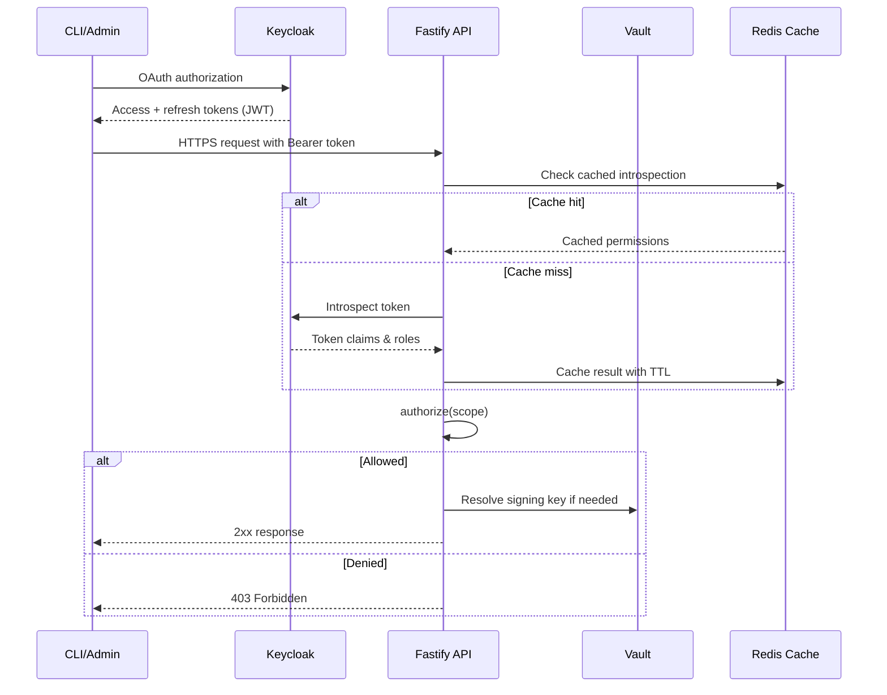

# Backend Architecture
## Service Architecture
```text
apps/api/src/
├─ app.ts
├─ plugins/
│  ├─ auth.ts
│  ├─ redis.ts
│  ├─ postgres.ts
│  ├─ minio.ts
│  └─ vault.ts
├─ routes/
│  ├─ configurations/
│  ├─ bundles/
│  ├─ merchants/
│  └─ webhooks/
├─ services/
├─ repositories/
├─ queues/
└─ telemetry/
```

```typescript
import { FastifyInstance } from 'fastify';
import { z } from 'zod';
import { bundleService } from '@/services/bundle-service';
import { authorize } from '@/plugins/auth';

const launchBodySchema = z.object({
  configurationId: z.string().uuid(),
  seedHash: z.string().optional(),
  forcingOptions: z
    .object({
      skipValidations: z.boolean().optional(),
      replayRunId: z.string().uuid().optional(),
    })
    .optional(),
});

export async function registerBundleRoutes(app: FastifyInstance) {
  app.route({
    method: 'POST',
    url: '/api/v1/bundles',
    preHandler: authorize({ scope: 'bundle.write' }),
    schema: {
      tags: ['Bundles'],
      body: launchBodySchema,
      response: {
        202: { $ref: 'DocumentBundleRun#' },
      },
    },
    handler: async (request, reply) => {
      const body = launchBodySchema.parse(request.body);
      const result = await bundleService.launchRun({
        configurationId: body.configurationId,
        seedHash: body.seedHash,
        forcingOptions: body.forcingOptions,
        actor: request.user,
      });

      return reply.code(202).send(result);
    },
  });
}
```

## Database Architecture (Repository Example)
```typescript
import { db } from '@/plugins/postgres';
import { sql } from 'drizzle-orm';
import { bundleRuns } from '@/plugins/postgres/schema';
import type { BundleStatus } from '@/types/domain';

export const bundleRepo = {
  async createRun(input: {
    id: string;
    configurationId: string;
    seedHash: string;
    triggeredByType: string;
    triggeredById: string;
    runParameters: Record<string, unknown>;
  }) {
    await db.insert(bundleRuns).values({
      id: input.id,
      configurationId: input.configurationId,
      seedHash: input.seedHash,
      status: 'pending',
      triggeredByType: input.triggeredByType,
      triggeredById: input.triggeredById,
      runParameters: input.runParameters,
    });

    return this.findById(input.id);
  },

  findById(id: string) {
    return db.query.bundleRuns.findFirst({
      where: (fields, { eq }) => eq(fields.id, id),
      with: {
        manifest: true,
        artefacts: true,
      },
    });
  },

  async updateStatus(id: string, status: BundleStatus) {
    await db
      .update(bundleRuns)
      .set({ status, completedAt: status === 'completed' ? sql`NOW()` : null })
      .where((fields, { eq }) => eq(fields.id, id));
  },
};
```

## Authentication & Authorization


```typescript
import createHttpError from 'http-errors';
import type { FastifyInstance } from 'fastify';

export function registerErrorHandler(app: FastifyInstance) {
  app.setErrorHandler((error, request, reply) => {
    const requestId = request.id;

    request.log.error({ err: error, requestId }, 'Request failed');

    if (createHttpError.isHttpError(error)) {
      const { statusCode, message } = error;
      reply.status(statusCode).send({
        error: {
          code: error.expose ? error.name : 'INTERNAL_ERROR',
          message: error.expose ? message : 'Something went wrong',
          details: error.expose ? error : undefined,
          timestamp: new Date().toISOString(),
          requestId,
        },
      });
      return;
    }

    reply.status(500).send({
      error: {
        code: 'INTERNAL_ERROR',
        message: 'Something went wrong',
        timestamp: new Date().toISOString(),
        requestId,
      },
    });
  });
}
```
