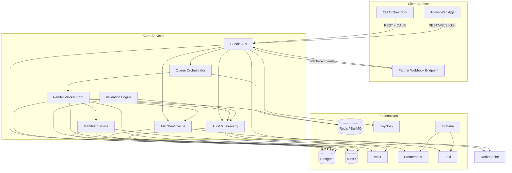

# Components
## CLI Orchestrator
**Responsibility:** Collects operator inputs, validates seeds against shared schemas, and triggers bundle runs while streaming telemetry updates in terminal sessions.

**Key Interfaces:** `POST /api/v1/configurations`, `POST /api/v1/bundles`

**Dependencies:** Bundle API, Keycloak device flow, shared config package.

**Technology Stack:** Node.js TypeScript CLI, pnpm workspace in `apps/cli`, uses WebSockets for live updates.

## Admin Web App
**Responsibility:** Surfaces run dashboards, validation results, manifest previews, and compliance approval workflows for reviewers, including dual-approval override requests.

**Key Interfaces:** `GET /api/v1/bundles`, WebSocket run events.

**Dependencies:** Bundle API, Keycloak auth, shared UI library, Prometheus metrics endpoint.

**Technology Stack:** Next.js 14, Radix UI + shadcn, Tailwind CSS; containerized for Compose.

## Bundle API (Fastify)
**Responsibility:** Core REST layer exposing configurations, bundle management, artefact access, validations, and webhook dispatch.

**Key Interfaces:** REST endpoints defined in OpenAPI; Socket.IO event stream to admin UI.

**Dependencies:** Postgres, Redis, MinIO, Vault, domain packages.

## Queue Orchestrator
**Responsibility:** Coordinates long-running bundle jobs, enqueues rendering/validation tasks, and manages retries.

**Key Interfaces:** BullMQ queues, Redis pub/sub.

**Dependencies:** Redis, Worker pool, Postgres snapshots.

## Render Worker Pool
**Responsibility:** Processes rendering tasks, generates PDFs via Puppeteer, reconciles data, and uploads artefacts to MinIO.

**Dependencies:** Redis, Postgres, MinIO, Vault, Google Places cache.

## Validation Engine
**Responsibility:** Executes deterministic reconciliation and compliance rules, recording outcomes for gating and telemetry.

## Manifest Service
**Responsibility:** Produces signed manifests, calculates hashes, and stores signature metadata for each bundle.

## Merchant & Employer Cache
**Responsibility:** Centralizes Google Places lookups, caching enriched profiles for deterministic metadata reuse.

## Audit & Telemetry Service
**Responsibility:** Aggregates audit logs, metrics, and log streams ensuring compliance traceability and operational insight.

## Auth & Access Control (Keycloak)
**Responsibility:** Issues OAuth tokens, manages roles, handles CLI device flows.

## Component Diagram

