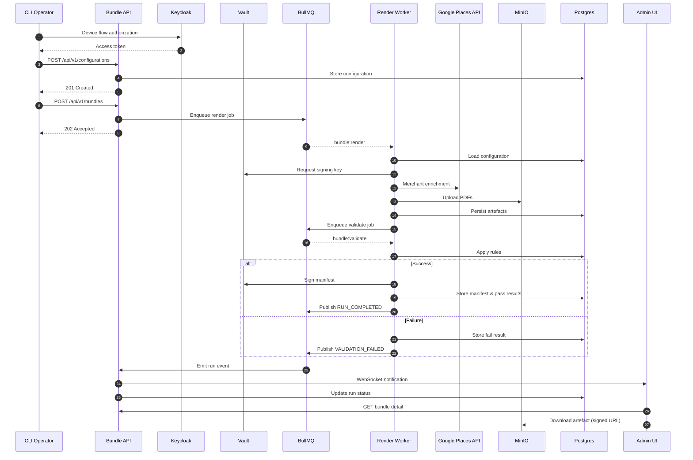
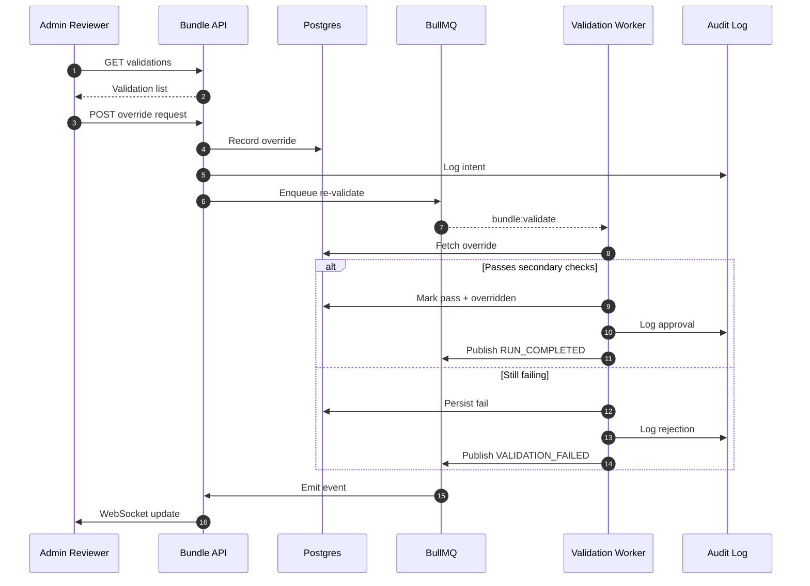

# Core Workflows

Dual-approval is enforced: reviewers create `pending` requests, compliance leads approve with reauthentication, and audit logs capture both actions. See `docs/runbooks/override-approval.md` for the operational checklist.
