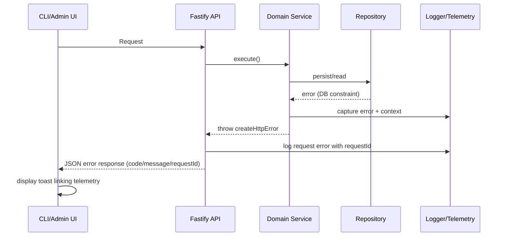

# Error Handling Strategy


```typescript
interface ApiError {
  error: {
    code: string;
    message: string;
    details?: Record<string, any>;
    timestamp: string;
    requestId: string;
  };
}
```

```typescript
import { toastEmitter } from '@/lib/toast-emitter';
import type { ApiError } from '@/types/openapi';

export function handleApiError(error: unknown) {
  if (typeof error === 'object' && error !== null && 'error' in error) {
    const apiError = error as ApiError;
    toastEmitter.emit('toast', {
      title: apiError.error.code,
      description: apiError.error.message,
      variant: 'destructive',
      action: {
        label: 'View Logs',
        onClick: () => window.open(`/telemetry?requestId=${apiError.error.requestId}`, '_blank'),
      },
    });
    return;
  }

  toastEmitter.emit('toast', {
    title: 'Unexpected error',
    description: 'An unexpected error occurred. Check the console for details.',
    variant: 'destructive',
  });
}
```

```typescript
import createHttpError from 'http-errors';
import type { FastifyInstance } from 'fastify';

export function registerErrorHandler(app: FastifyInstance) {
  app.setErrorHandler((error, request, reply) => {
    const requestId = request.id;

    request.log.error({ err: error, requestId }, 'Request failed');

    if (createHttpError.isHttpError(error)) {
      const { statusCode, message } = error;
      reply.status(statusCode).send({
        error: {
          code: error.expose ? error.name : 'INTERNAL_ERROR',
          message: error.expose ? message : 'Something went wrong',
          details: error.expose ? error : undefined,
          timestamp: new Date().toISOString(),
          requestId,
        },
      });
      return;
    }

    reply.status(500).send({
      error: {
        code: 'INTERNAL_ERROR',
        message: 'Something went wrong',
        timestamp: new Date().toISOString(),
        requestId,
      },
    });
  });
}
```
