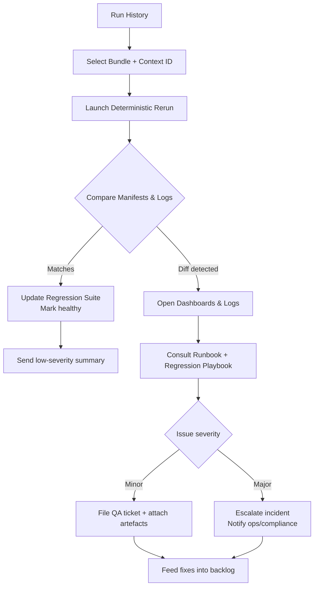

# DocuGen UI/UX Specification

## Introduction
This document defines the user experience goals, information architecture, user flows, and visual design specifications for DocuGen’s user interface. It anchors how deterministic bundle generation, compliance reviews, and fintech integrations show up in the CLI and admin experiences so engineering, design, and operations teams deliver a cohesive, user-centered workflow.

### Overall UX Goals & Principles

#### Target User Personas
- **Lending Operations Specialist:** Triggers NAB-fidelity bundles through guided CLI or admin flows; depends on proactive validation guardrails and quick access to run manifests to keep processing under tight SLAs.
- **Compliance Reviewer:** Verifies artefacts against policy; needs signed manifests, human-readable diffs, and transparent rule outcomes before approving bundles.
- **Fintech Integration Engineer:** Embeds the CLI/API into partner systems; relies on deterministic telemetry, sandbox diagnostics, and documentation that maps UX cues to log and metric endpoints.
- _(Optional)_ **Quality Assurance Lead:** Confirms deterministic behaviour across environments; requires hooks from UI states to automated regression suites and observability dashboards.

#### Usability Goals
- **Bundle assembly time:** Lending operations completes NAB-aligned document bundles in ≤5 minutes via guided flows, with validation guardrails preventing non-compliant runs before generation starts.
- **Deterministic reruns:** Identical seeds rerun in staging within ≤30 seconds, emitting matching manifests and highlighting any visual/data discrepancies in plain language.
- **Audit readiness:** Compliance reviewers clear ≥95% of bundles on first pass, supported by signed manifests, diff overlays, and traceable rule evaluations accessible directly from the UI.
- **Telemetry handoff:** Integration engineers reach linked observability dashboards or CLI logs within one click from UI status surfaces, supporting swift troubleshooting and QA alignment.

#### Design Principles
1. **Guardrails before generation** – surface responsible-lending checks, data validation, and dependency readiness before users trigger bundle creation.
2. **Trust through transparency** – expose manifest signatures, diff overlays, and rule outcomes so compliance can audit without leaving the flow.
3. **Progressive confidence** – unlock advanced options only after baseline validations pass, reinforcing determinism and reducing novice overload.
4. **Role-tailored workspaces** – adapt navigation, terminology, and shortcuts to the needs of operations, compliance, integration, and QA stakeholders.
5. **Accessible & inclusive surfaces** – satisfy WCAG 2.1 AA, provide high-contrast CLI/Admin themes, and favour plain-language microcopy for regulated contexts.
6. **Traceable automation** – connect UI states to telemetry, logs, and regression hooks so every action is observable and testable end to end.

### Information Architecture (IA)

#### Site Map / Screen Inventory

```mermaid
graph TD
    A[Operations Home] --> A1[Run Status Summary]
    A --> A2[Pending Reviews Queue]
    A --> A3[System Health Snapshot]

    A --> B[Generate Bundles]
    B --> B1[Start New Run Wizard]
    B --> B2[Run History]
    B --> B3[Manifest Explorer]
    B --> B4[Seed & Data Library]

    A --> C[Compliance Review]
    C --> C1[Rule Violations]
    C --> C2[Approval Queue]
    C --> C3[Diff Viewer]

    A --> D[Artefact Library]
    D --> D1[Bank Statements]
    D --> D2[Payslips]
    D --> D3[Proof of Balance]
    D --> D4[Download Packages]

    A --> E[Integrations & Monitoring]
    E --> E1[CLI Companion]
    E --> E2[API & Webhooks]
    E --> E3[Dashboards & Logs]
    E --> E4[Alerts & Runbooks]
    E --> E5[Template Configuration]
    E --> E6[Secrets & Environments]

    A --> F[Support & Documentation]
    F --> F1[Compliance & Accessibility Guides]
    F --> F2[Regression Playbooks]
    F --> F3[Incident Playbooks]
```


#### Navigation Structure
**Primary Navigation:** Operations Home, Generate Bundles, Compliance Review, Artefact Library, Integrations & Monitoring, Support & Documentation.

**Secondary Navigation:** Contextual tabs per area (e.g., Generate Bundles → Start New Run, Run History, Manifest Explorer, Seed Library; Compliance Review → Rule Violations, Approval Queue, Diff Viewer; Integrations & Monitoring → CLI Companion, API & Webhooks, Dashboards & Logs, Alerts & Runbooks, Template Configuration, Secrets & Environments). Global quick actions surface “Start Run”, “Import Seed”, “View Bundle Telemetry”, and “Open CLI” from any screen, while persistent filters (SLA status, rule severity, bundle state) sit at the top of list views to keep SLAs visible.

**Breadcrumb Strategy:** `Operations Home > Section > Subsection > Record` with inline status chips (e.g., `Bundle #482 • Waiting for Compliance`) and shortcut buttons to manifests, telemetry dashboards, and CLI context so operators never lose traceability when pivoting between review, debugging, and approvals. Wizard-style flows (Start New Run) show step indicators inside the page to reduce breadcrumb noise, and Run History detail pages include direct links into Diff Viewer and Dashboards & Logs for same-screen investigation.

**Rationale:** The updated map uses stakeholder language while preserving the deterministic bundle lifecycle. Generate Bundles captures launch and rerun workflows with manifest visibility; Compliance Review centralises approvals and diff tooling so compliance can act quickly; Artefact Library keeps NAB artefacts organised post-approval. Integrations & Monitoring unifies CLI, API, telemetry, and alerting so engineers troubleshoot without context switching, with redundant entry points from run detail views. Support & Documentation stays prominent for accessibility checklists, regulatory guidance, regression playbooks, and runbooks, ensuring QA and compliance teams stay aligned.

### Change Log
| Date | Version | Description | Author |
| --- | --- | --- | --- |
| 2025-02-14 | 0.2 | Added IA draft | Sally (UX Expert) |
| 2025-09-27 | 0.3 | Updated DocuGen intro, personas, usability goals, and navigation | Sally (UX Expert) |
| 2025-09-27 | 0.4 | Added user flows, component inventory, accessibility, responsiveness, motion, performance, next steps | Sally (UX Expert) |

### User Flows

#### Flow 1: Generate Deterministic Bundle (Lending Operations)
```mermaid
flowchart TD
    A[Start New Run Wizard] --> B{Pre-Flight Validation}
    B -->|Blocking issue| C[Surface errors + keyboard-focus corrections]
    C --> A
    B -->|Warnings| D[Warn + require acknowledgement]
    D --> E[Guardrail Review
Context ID issued]
    B -->|Clean| E
    E --> F[Trigger Generation]
    F --> G[Render Manifest Summary
SLA timer visible]
    G --> H[Consolidated notification
(Success/Warning) via Ops channel]
    G --> I[Open Diff & Dashboards
via context ID]
    H --> J[Ready for Compliance Review]
```
- Acceptance checkpoints: guardrails block progress until blocking issues resolved; warnings require explicit acknowledgement with accessible modal controls.
- Notifications: single summary message per run (severity-tagged) routes through operations channel to prevent alert fatigue.
- Accessibility hooks: validation highlights support keyboard focus order, screen-reader friendly copy, and high-contrast themes.
- Regression artefacts: manifest JSON, signed hash, and generation logs stored against the context ID for later flows.

#### Flow 2: Compliance Review & Approval
```mermaid
flowchart TD
    A[Compliance Queue] --> B[Open Bundle via Context ID]
    B --> C[Review Signed Manifest]
    C --> D[Launch Diff Viewer (keyboard navigable)]
    D --> E[Inspect Rule Outcomes]
    E -->|Passes| F[Approve Bundle]
    F --> G[Log decision + signature]
    G --> H[Notify stakeholders (single summary)]
    E -->|Issues| I[Reject with rationale]
    I --> J[Route rationale to Operations]
    J --> K[Operations adjust inputs and restart Flow 1]
```
- Signed manifests, diff overlays, and rule outcome summaries remain one click away using the shared context ID.
- Accessibility: diff viewer exposes keyboard shortcuts, high-contrast comparison mode, and descriptive narration for discrepancies.
- Notifications: one consolidated approval/rejection summary per bundle, tagged for compliance audit logs and routed to operations/integration leads.
- Audit trail: approvals append timestamps and reviewer signature; rejections include structured rationale to unblock Flow 1 restarts.

#### Flow 3: Investigate Run Regression (Integration & QA)

- Deterministic reruns reuse the context ID to ensure manifests/logs align with Flow 1 outputs; exports are captured for automated regression suites.
- Telemetry handoff: dashboards/logs launched from the same detail view, preserving traceability and enabling one-click analysis.
- Notifications follow severity tagging to existing incident channels; low severity stays informational, high severity triggers escalation runbooks.
- Accessibility and QA: rerun results page provides keyboard navigation through diff summaries and supports screen-reader annotations for log comparisons.

### Component Inventory

#### Navigation & Layout Components
- **PrimaryNavBar** — top-level navigation showing Operations Home, Generate Bundles, Compliance Review, Artefact Library, Integrations & Monitoring, Support & Documentation.
  - Props: `activeSection`, `pendingApprovalsCount`, `alertsBadgeCount`, `slaBreachCount`, `highContrastMode`.
  - States: Default (light), High Contrast (dark), Compact (mobile), Focus Visible, Read-only audit view.
  - Rationale: Keeps role-based navigation consistent, surfaces SLA breach badges inline, and supports printable audit snapshots; high-contrast and focus states meet accessibility commitments.
- **QuickActionsTray** — persistent action strip for `Start Run`, `Import Seed`, `View Bundle Telemetry`, `Open CLI`.
  - Props: `actions[]`, `contextId`, `disabledReasons`, `guardrailTooltip` (plain-language explanation).
  - States: Enabled, Disabled (missing permissions/guardrail), Loading (awaiting manifest), Keyboard Focus.
  - Rationale: Mirrors “guardrails before generation” by disabling actions when prerequisites fail and communicating blockers with accessible, plain-language tooltips.

#### Operations Dashboard Widgets
- **SLAStatCard** — surfaces bundle SLA timer and status.
  - Props: `remainingTime`, `status` (`on-track`, `warning`, `breach`), `contextId` link.
  - States: Neutral (green), Warning (amber), Breach (red, animates politely), Screen-reader announcement on state change.
- **ValidationSummaryPanel** — lists blocking issues and warnings from pre-flight checks.
  - Props: `blockingIssues[]`, `warnings[]`, `acknowledgedWarnings`.
  - States: Collapsed, Expanded, Accessibility Audit Fail (prompts remediation link).
- **RunHistoryTable** — tabular view with filters for SLA, rule severity, ownership.
  - Columns: Bundle ID, Context ID, Status, SLA Status, Last Action, Owner; CSV/JSON export includes context IDs for automation.
  - States: Default, Filtered, Empty (call-to-action), Loading skeleton; supports virtualized rows for large data sets and keyboard shortcuts for power users.

#### Compliance Review Components
- **ManifestSummaryPanel** — displays signed manifest metadata.
  - Props: `manifestHash`, `generatedAt`, `signedBy`, `downloadHref`, `printMode` toggle.
  - States: Valid signature, Signature mismatch (alert), Read-only, Print-for-audit snapshot.
- **DiffViewer** — side-by-side document comparison with accessibility aids.
  - Props: `leftDocUrl`, `rightDocUrl`, `diffHighlights`, `contrastMode`, `healthIndicator` (Grafana/log service availability).
  - States: Default, High Contrast, Keyboard Navigation (focus outlines), Screen-reader narration enabled, Degraded telemetry (warn users links may fail).
- **RuleOutcomeList** — accordion of responsible-lending rule checks.
  - Props: `rules[]` (id, status, notes, severity).
  - States: All-pass, Warning, Blocker.
- **DecisionBanner** — approve/reject CTA with rationale capture.
  - Props: `decision`, `rationale`, `requiresEscalation`, `contextId`, `printMode` toggle.
  - States: Neutral (awaiting decision), Approve (confirm modal), Reject (requires structured rationale), Disabled (missing required fields), Read-only audit snapshot.

#### Notifications & Messaging
- **BundleSummaryToast** — consolidated success/warning/error notification.
  - Props: `severity`, `message`, `contextId`, `viewDetailsHref`, `detailsLogged` flag.
  - States: Success (green), Warning (amber), Error (red), Sticky (requires user dismissal), Reduced Motion variant; detailed payloads captured in audit logs even when notification stays summary-only.
- **IncidentAlertDrawer** — high-severity incident panel fed from Observability.
  - Props: `incidentId`, `severity`, `impactedBundles[]`, `runbookHref`.
  - States: Info, Warning, Critical; includes acknowledgement workflow for QA/ops leads.

#### Forms, Modals, and Inputs
- **PreFlightValidationForm** — collects run parameters and resolves validation feedback inline.
  - Inputs: Account selection, Date ranges, Seed selection, Responsible-lending toggles.
  - States: Draft, Validation Error, Warning acknowledged, Accessibility audit fail; issues `contextId` on first successful validation.
- **WarningAcknowledgementModal** — forces review of warnings before progression.
  - Props: `warnings[]`, `acknowledgementChecklist`, `confirmLabel`.
  - States: Default, Keyboard Focus trap, Screen-reader summary mode.
- **RejectRationaleForm** — structured rejection template with required fields and severity tags.
  - Fields: Root cause, Impact, Required remediation, SLA impact toggle.
  - States: Draft, Validation Error (missing impact), Submitted (locked with signature); notes retention policy (minimum 7 years, encrypted at rest, purge automation per compliance).

#### Observability & QA Components
- **TelemetryLinkBar** — context-aware shortcuts to dashboards, logs, regression suite.
  - Props: `contextId`, `dashboards[]`, `logs[]`, `regressionSuiteUrl`, `serviceHealth` indicator.
  - States: Ready, Loading (pending sync), Error (link unreachable), Degraded (warn user when telemetry providers report issues).
- **RegressionStatusBadge** — indicates health of automated suites for the bundle.
  - Props: `status` (`healthy`, `degraded`, `failing`), `lastRunAt`, `detailsHref`, `artefactStorage` (links to screenshots/diffs).
  - States: Default, Warning (degraded), Error (failing) with accessible tooltip narration; tooltips declare storage locations and retention.
- **RunbookStepper** — guides engineers through remediation steps.
  - Props: `steps[]`, `currentStep`, `complete`, `testId` metadata for automation scripts.
  - States: In Progress, Completed, Requires escalation (triggers incident alert); provides ARIA landmarks and stable test IDs for automated UI coverage.

#### Rationale
- Components map directly to navigation and flow requirements, ensuring UI consistency across operations, compliance, integration, and QA personas.
- Prop/state definitions include accessibility, telemetry, health indicators, and print modes so implementation teams capture non-negotiable behaviours (SLA badges, guardrail tooltips, audit snapshots).
- Observability and QA elements (TelemetryLinkBar, RegressionStatusBadge) keep traceability visible, document artefact storage/retention, and satisfy “traceable automation” plus telemetry handoff goals.
- Structured forms (PreFlightValidationForm, RejectRationaleForm) enforce compliance data capture, deterministic rerun prerequisites, retention policy obligations, and provide stable test IDs/ARIA hooks for automation.
### Accessibility Requirements

**Standard:** WCAG 2.1 AA + Australian DTA Service Standard alignment for internal tools.

**Visual:**
- Color contrast ratios: ≥4.5:1 for body text, ≥3:1 for large text; telemetry badges use tokenised palettes meeting contrast in light/dark/high-contrast themes.
- Focus indicators: 2px outlines with ≥3:1 contrast plus non-color cue on all actionable elements, including diff highlights and QuickActions controls.
- Text sizing: Base 16px with reflow support up to 200% without loss of content or functionality; CLI companion inherits terminal accessibility preferences.

**Interaction:**
- Keyboard navigation: Full tab/shift-tab coverage, roving tabindex in nav, arrow-key navigation in tables/diffs, skip links targeting `#main-content`, `#validation-summary`, and `#run-status` anchors.
- Screen reader support: ARIA landmarks per primary panel, live-region announcements for SLA breaches/guardrail warnings, descriptive labels for telemetry/diff elements.
- Touch targets: Minimum 44×44 px interactive areas with spacing tuned for tablet compliance reviews.

**Content:**
- Alternative text: Programmatic alt text for status icons, diff snapshots, telemetry badges; dynamic copy includes severity and next step.
- Heading structure: Semantic H1–H4 hierarchy mirrors navigation for assistive technology.
- Form labels: Explicit labels, helper text, and linked inline errors via `aria-describedby` for validation, warning acknowledgement, and rejection forms.

**Testing Strategy:** Automated axe-core/pa11y scans per build; quarterly manual audits with NVDA/VoiceOver, keyboard-only guardrail flow walkthroughs, and touch testing on tablet; outcomes logged against bundle context IDs in regression suite.

### Responsiveness Strategy

| Breakpoint | Min Width | Max Width | Target Devices |
| --- | --- | --- | --- |
| Mobile | 320px | 767px | Operator smartphones, compliance tablets in portrait |
| Tablet | 768px | 1023px | iPad landscape, Surface Go running admin portal |
| Desktop | 1024px | 1439px | Standard lending ops workstations, QA laptops |
| Wide | 1440px | - | Trading floor ultrawide monitors, compliance review dual-screen setups |

**Layout Changes:** Responsive grid snaps from single-column (mobile) → two-column split (tablet, with Observability widgets collapsed into accordion) → primary + secondary rail (desktop) → three-column telemetry layout (wide, Observability column pinned). Validation summary and run status cards stay top-of-stack on all breakpoints.

**Navigation Changes:** PrimaryNavBar collapses to hamburger on mobile with quick-access icons for Start Run and Alerts; desktop/wide show full labels plus inline SLA breach badges; QuickActionsTray docks to bottom on mobile for thumb reach.

**Content Priority:** Mobile emphasises run status, pending actions, and guardrail resolution; secondary analytics hide behind “View Telemetry” drawer. Tablet exposes accordion summaries for telemetry/alerts; desktop/wide reintroduce Manifest Explorer, diff previews, and full telemetry dashboards side-by-side.

**Interaction Changes:** Touch targets enlarge to 52×52px on mobile/tablet; drag-and-drop disabled below tablet landscape; keyboard shortcuts remain across breakpoints. SLA countdown animates subtly on desktop/wide but downgrades to static text on mobile to preserve performance.

### Animation & Micro-interactions

**Motion Principles:** Prioritise clarity over flair, keep motion duration ≤200 ms for operational actions, always provide reduced-motion equivalents, and tie micro-interactions to explicit state changes (guardrails, approvals, telemetry updates).

- **Guardrail Validation Feedback:** 160 ms fade-in/out of inline validation banners with easing `ease-out`; reduced motion swaps animation for instant appear/disappear with color change only.
- **SLA Countdown Pulse:** Desktop/wide countdown numerals pulse at 1.5 s intervals using `ease-in-out`; reduced motion shows static color shift from green → amber → red with no scale change.
- **Diff Highlight Reveal:** 120 ms slide/fade on diff overlays when reviewers step through discrepancies (`ease-out`); keyboard navigation triggers same timing; reduced motion uses solid outline without animation.
- **Telemetry Sync Indicator:** 180 ms rotate + fade sequence on sync icon (`linear`), capped at three loops; degraded telemetry state switches to static warning icon with textual status.
- **Incident Alert Drawer:** 200 ms slide-in from right (`cubic-bezier(0.2, 0, 0.2, 1)`), focus immediately lands on heading; reduced motion shows instant overlay with focus trap.

### Performance Considerations

- **Page Load:** ≤2.5 s Largest Contentful Paint for dashboard views on standard ops workstations; ≤3.0 s on tablets over corporate VPN.
- **Interaction Response:** Critical actions (Start Run, Approve/Reject, Diff navigation) respond within 150 ms; telemetry refresh actions complete ≤500 ms under normal conditions.
- **Animation FPS:** Maintain ≥60 fps for micro-interactions on desktop/wide; reduced-motion variants default to 0 animation for devices struggling to hit 30 fps.

**Design Strategies:**
- Leverage skeleton loading for RunHistoryTable and ManifestSummaryPanel, fetching diff/telemetry data lazily via context ID after primary content renders.
- Cache recent manifests and telemetry snapshots client-side (encrypted) per context ID to accelerate reruns while respecting compliance retention rules.
- Use CSS GPU-accelerated transforms for micro-interactions, avoid layout-thrashing properties (top/left) to keep animations smooth.
- Degrade gracefully on mobile/tablet by deferring telemetry widgets to “View Telemetry” drawer and disabling costly drag-and-drop interactions.
- Instrument performance metrics (LCP, TTI, interaction latency) via shared telemetry endpoints, surfacing trends in Observability dashboards for QA and ops monitoring.

### Next Steps

1. Review this spec with lending operations, compliance, integration engineering, and QA leads; capture sign-off alongside context IDs for traceability.
2. Translate flows and component specs into design tool artifacts (Figma) with responsive breakpoints, motion specs, and accessibility annotations.
3. Partner with Design Architect/frontend leads to map components to implementation roadmap, aligning telemetry and retention dependencies early.
4. Compile open questions: context ID generation edge cases, long-term artefact storage policies, incident escalation SLAs, and CLI companion accessibility parity.

**Design Handoff Checklist**
- [ ] All user flows documented
- [ ] Component inventory complete
- [ ] Accessibility requirements defined
- [ ] Responsive strategy clear
- [ ] Brand guidelines incorporated
- [ ] Performance goals established

### Checklist Results

No dedicated UI/UX checklist available for DocuGen yet; manual review performed against accessibility, responsiveness, and performance sections above, with pending items tracked in the Design Handoff Checklist.
